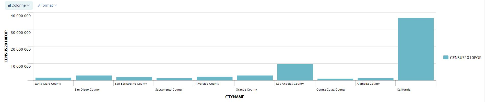

# Exploring Splunk queries #

1. Searching in Splunk
2. Filter fields for specific values
3. Perform statistical calculations
 

I have already imported the csv file (census.csv), let's start searching.

## Filtering for specific values ##

Find entries where the state is **California** thanks to **STNAME** field which contains the name of the state

    source="census.csv" sourcetype="csv" STNAME="California"

Find entries where the state is **California** or **Alaska**

    source="census.csv" sourcetype="csv" STNAME="California" OR STNAME="Alaska"

Search multiple fields with specific values: for example, let's search for state name **California** and 2010 population greater than one million people

    source="census.csv" sourcetype="csv" STNAME="California" CENSUS2010POP > 1000000

Let's filter out the previous command to show only conty name column

    source="census.csv" sourcetype="csv" STNAME="California" CENSUS2010POP > 1000000 | table CTYNAME

We can also sort results, let's search for all items with a population greater than 100000, sorts the results in descending order, and create a table containing the population and state name

    source="census.csv" sourcetype="csv" STNAME="California" CENSUS2010POP > 1000000 | sort CENSUS2010POP desc | table CENSUS2010POP,STNAME

Let's now plot a query with the **visualization** tab

    source="census.csv" sourcetype="csv" STNAME="California" CENSUS2010POP > 1000000 | table CTYNAME,CENSUS2010POP

Result:

## Perform statistical calculation ##

Let's count the results where the state is **California**

    source="census.csv" sourcetype="csv" STNAME="California" | stats count

We can also compute the **total** and **average** 2010 population for **California**

    source="census.csv" sourcetype="csv" STNAME="California" | stats sum(CENSUS2010POP)
    source="census.csv" sourcetype="csv" STNAME="California" | stats mean(CENSUS2010POP)
	
	

