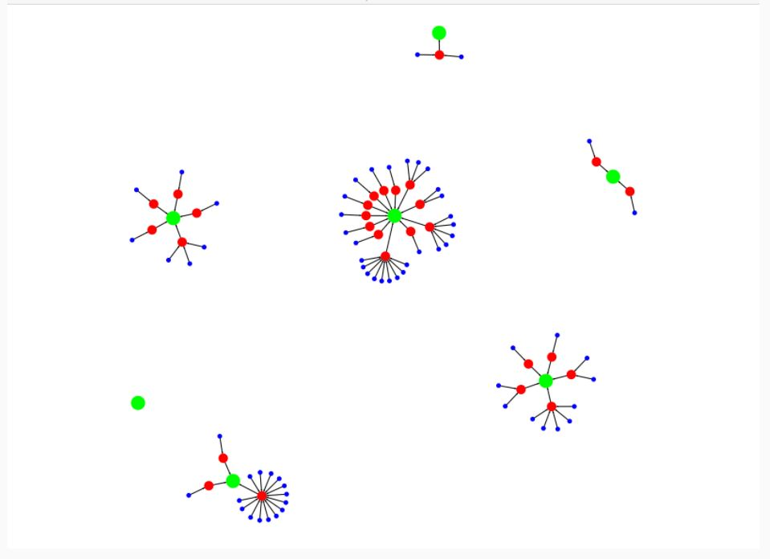
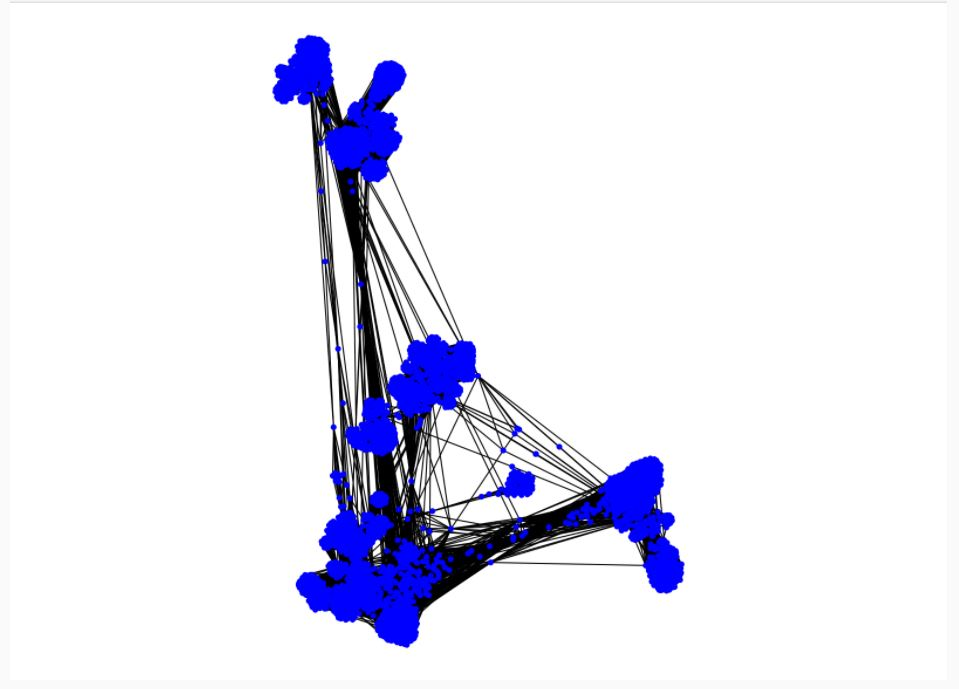

# Network connectedness and clustering components #
1. Create a new graph by adding the Continents dataset
2. Import the GraphStream library
3. Import countriesGraph into a GraphStream SingleGraph
4. Visualize countriesGraph
5. Visualize Facebook graph 

**File 4**

## Create a new graph by adding the Continents dataset ##
To make the graph more interesting, let's create a new graph and add the continents. But first, we will print files content.

    Source.fromFile("./EOADATA/continent.csv").getLines().take(5).foreach(println)
    Source.fromFile("./EOADATA/country_continent.csv").getLines().take(5).foreach(println)

Create **Continent** class

    case class Continent(override val name: String) extends PlaceNode(name)

### Import vertices and edges ###

    val continents: RDD[(VertexId, PlaceNode)] =
      sc.textFile("./EOADATA/continent.csv").
    filter(! _.startsWith("#")).
    map {line =>
      val row = line split ','
      (200L + row(0).toInt, Continent(row(1))) // Add 200 to the VertexId to keep the indexes unique
    }
    
    
    val cclinks: RDD[Edge[Int]] =
      sc.textFile("./EOADATA/country_continent.csv").
    filter(! _.startsWith("#")).
    map {line =>
      val row = line split ','
      Edge(100L + row(0).toInt, 200L + row(1).toInt, 1)
    }

Concatenate the three sets of nodes into a single RDD. Then, concatenate the two sets of edges and create the graph.

    val cnodes = metros ++ countries ++ continents
    val clinks = mclinks ++ cclinks
    val countriesGraph = Graph(cnodes, clinks)

## Import the GraphStream library ##

    import org.graphstream.graph.implementations._

Create a new instance of GraphStream's SingleGraph class using the countriesGraph.

    val graph: SingleGraph = new SingleGraph("countriesGraph")

Set up the visual attributes for graph visualization.

    graph.addAttribute("ui.stylesheet","url(file:.//style/stylesheet)")
    graph.addAttribute("ui.quality")
    graph.addAttribute("ui.antialias")

Load the graphX vertices into GraphStream nodes.

    for ((id:VertexId, place:PlaceNode) <- countriesGraph.vertices.collect())
    {
      val node = graph.addNode(id.toString).asInstanceOf[SingleNode]
      node.addAttribute("name", place.name)
      node.addAttribute("ui.label", place.name)
    
      if (place.isInstanceOf[Metro])
    node.addAttribute("ui.class", "metro")
      else if(place.isInstanceOf[Country])
    node.addAttribute("ui.class", "country")
      else if(place.isInstanceOf[Continent])
    node.addAttribute("ui.class", "continent")
    }
    
Load the graphX edges into GraphStream edges.

    for (Edge(x,y,_) <- countriesGraph.edges.collect()) {
      graph.addEdge(x.toString ++ y.toString, x.toString, y.toString, true).asInstanceOf[AbstractEdge]
    }
    
## Display the graph. ##
The metros are the small blue dots, the countries are the medium red dots and the continents are the large green dots.

    graph.display()

## Visualize Facebook graph ##
Run the spark-shell with the Facebook.scala file to visualize the Facebook dataset.

    spark-shell --jars lib/gs-core-1.2.jar,lib/gs-ui-1.2.jar,lib/jcommon-1.0.16.jar,lib/jfreechart-1.0.13.jar,lib/breeze_2.10-0.9.jar,lib/breeze-viz_2.10-0.9.jar,lib/pherd-1.0.jar -i Facebook.scala 

 

