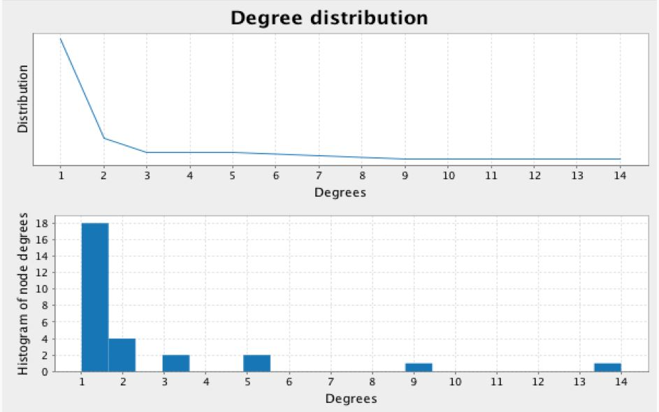

# Plot the degree histogram #
1. Import the BreezeViz library
2. Define a function to calculate the degree histogram
3. Calculate the probability distribution for the degree histogram
4. Plot the results 

**File 3**

## Import the BreezeViz library ##
    import breeze.linalg._
    import breeze.plot._

## Define a function to calculate the degree histogram ##
Define a function to create a histogram of the degrees.

    def degreeHistogram(net: Graph[PlaceNode, Int]): Array[(Int, Int)] =
      net.degrees.
    filter { case (vid, count) => vid >= 100 }.
    map(t => (t._2,t._1)).
    groupByKey.map(t => (t._1,t._2.size)).
    sortBy(_._1).collect()

## Calculate the probability distribution for the degree histogram ##
Get the probability distribution (degree distribution) from the degree histogram by normalizing the node degrees by the total number of nodes, so that the degree probabilities add up to one.

    val nn = metrosGraph.vertices.filter{ case (vid, count) => vid >= 100 }.count()
    val metroDegreeDistribution = degreeHistogram(metrosGraph).map({case(d,n) => (d,n.toDouble/nn)})

## Plot the results ##
Plot degree distribution and the histogram of vertex degrees.

    val f = Figure()
    val p1 = f.subplot(2,1,0)
    val x = new DenseVector(metroDegreeDistribution map (_._1.toDouble))
    val y = new DenseVector(metroDegreeDistribution map (_._2))
    
    p1.xlabel = "Degrees"
    p1.ylabel = "Distribution"
    p1 += plot(x, y)
    p1.title = "Degree distribution"
    
    
    val p2 = f.subplot(2,1,1)
    val metrosDegrees = metrosGraph.degrees.filter { case (vid, count) => vid >= 100 }.map(_._2).collect()
    
    p2.xlabel = "Degrees"
    p2.ylabel = "Histogram of node degrees"
    p2 += hist(metrosDegrees, 20)

## Final result: ##

